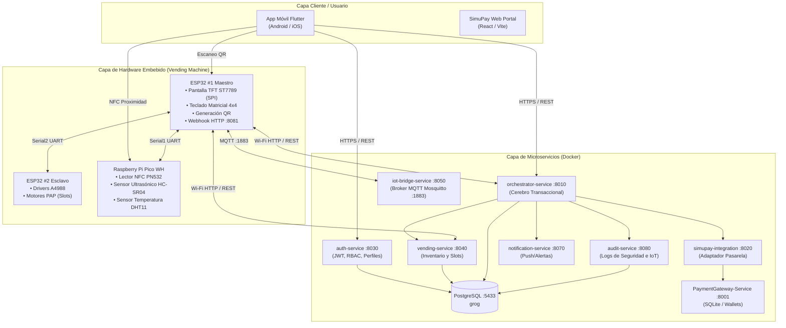
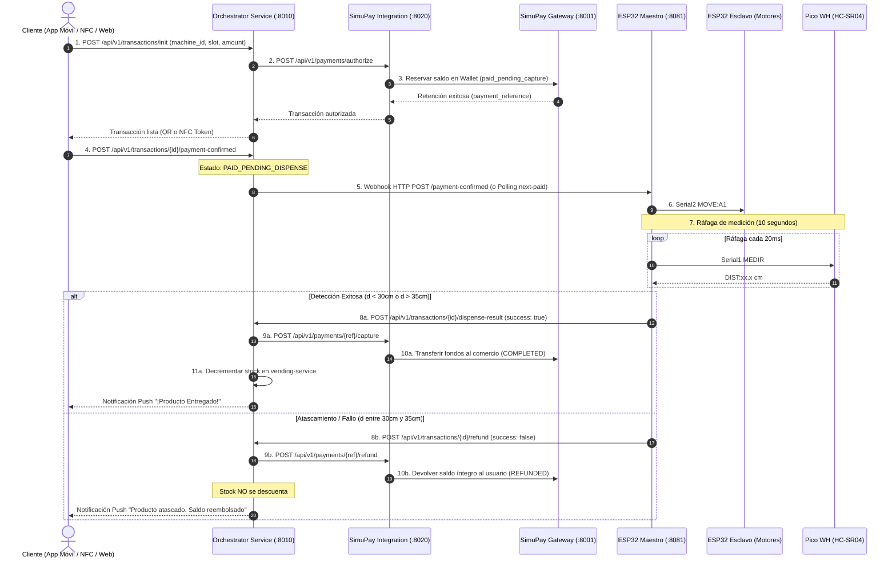

# Documentación Técnica y Arquitectura de la Plataforma GROG

**Sistema Integral de Máquina Expendedora Inteligente con Hardware Distribuido, Microservicios y Pasarela de Pagos (Fintech)**

---

## 1. Resumen Ejecutivo del Proyecto

La plataforma **GROG** es un ecosistema tecnológico ciberfísico (Cyber-Physical System / IoT) diseñado para modernizar y securizar la operación de máquinas expendedoras automatizadas. Resuelve los principales puntos de fricción del vending tradicional (atascamiento de productos, cobros indebidos, falta de telemetría y dependencia de efectivo) mediante:

1. **Hardware Distribuido Multiprocesador:** Arquitectura tripartita con separación de responsabilidades en tiempo real (ESP32 Maestro, ESP32 Esclavo y Raspberry Pi Pico WH).
2. **Backend de Microservicios:** Servicios modulares en contenedores Docker bajo FastAPI, PostgreSQL, SQLite y broker MQTT Eclipse Mosquitto.
3. **Flujo de Pago y Reembolso Atómico (Two-Phase Commit / Auth-Capture):** Integración con la pasarela SimuPay que garantiza que ningún cliente pague si el producto no cae físicamente de la ranura.
4. **Aplicación Móvil Híbrida (Flutter):** Interfaz cliente/administrador con apertura instantánea por proximidad NFC, autenticación biométrica, recarga de saldo y monitoreo IoT en vivo.

---

## 2. Arquitectura General del Sistema

El ecosistema se divide en cuatro capas claramente desacopladas:



---

## 3. Capa de Hardware Distribuido

La máquina expendedora no delega el control en un único microcontrolador, sino que distribuye las tareas críticas en **tres procesadores especializados** comunicados punto a punto por buses serie asíncronos (UART):

| Controlador | Rol Principal | Conexiones / Periféricos | Protocolo de Comunicación |
| :--- | :--- | :--- | :--- |
| **ESP32 #1 (Maestro)** | Orquestador físico, interfaz gráfica y conectividad Wi-Fi | • Pantalla TFT SPI ST7789<br/>• Teclado 4x4 (GPIOs 26,25,33,32,13,12,14,27)<br/>• Servidor Webhook local en puerto 8081 | • Wi-Fi 802.11 b/g/n (HTTP REST / MQTT)<br/>• Serial1 hacia Pico WH<br/>• Serial2 hacia ESP32 Motores |
| **ESP32 #2 (Esclavo)** | Controlador de potencia de actuadores | • Drivers paso a paso A4988<br/>• Motores bipolares NEMA de espirales | • UART Serial2 (RX=16, TX=17) a 115200 baud |
| **Raspberry Pi Pico WH** | Coprocesador sensorial de tiempo real | • Lector NFC PN532<br/>• Sensor ultrasónico HC-SR04<br/>• Sensor de temperatura/humedad DHT11 | • UART Serial1 (TX=GP4, RX=GP5) a 9600 baud con ESP32 Maestro |

### 3.1. Pines y Mapa de Conexión de Hardware

```
               ┌───────────────────────────────────────────┐
               │              ESP32 MAESTRO                │
               │                                           │
               │  GPIO 16 (RX2) <──────> TX (GPIO 17)      │ ESP32 Esclavo
               │  GPIO 17 (TX2) <──────> RX (GPIO 16)      │ (Motores)
               │                                           │
               │  GPIO 19 (RX1) <──────> GP4 (TX)          │ RPi Pico WH
               │  GPIO 22 (TX1) <──────> GP5 (RX)          │ (Sensores)
               │                                           │
               │  SPI (MOSI=23, SCLK=18, CS=15, DC=21)     │ Pantalla TFT
               │  GPIO 2 (Salida)       ──────> Relé Luces │ Iluminación
               └───────────────────────────────────────────┘
```

### 3.2. Firmware y Protocolo de Comandos Inter-Chip

La comunicación entre el ESP32 Maestro y los esclavos utiliza cadenas ASCII delimitadas por salto de línea (`\n`):

1. **Maestro $\rightarrow$ Esclavo de Motores (Serial2):**
   - Comando: `MOVE:A1\n` $\rightarrow$ Ordena al driver correspondiente al slot A1 realizar el ciclo completo de giro de la espiral.
   - Respuesta: `DONE\n` $\rightarrow$ Notifica al Maestro que el motor terminó de girar.
2. **Maestro $\rightarrow$ Pico WH Sensores (Serial1):**
   - `MEDIR\n` $\rightarrow$ Orden de disparo ultrasónico inmediato. Retorna `DIST:<float>\n` (ej: `DIST:32.4\n`).
   - `SCAN\n` $\rightarrow$ Solicita lectura de tarjeta NFC presente. Retorna `NFC:<uid_hex>\n`.
   - `PING\n` $\rightarrow$ Heartbeat de enlace. Retorna `PONG\n`.
3. **Pico WH $\rightarrow$ Maestro (Eventos asíncronos / Push):**
   - `NFC:<uid>\n` o `NFC:TOKEN:<token>\n` $\rightarrow$ Tarjeta física o sesión NDEF leída desde celular.
   - `TEMP:<float>\n` $\rightarrow$ Reporte periódico de temperatura interna (°C).

---

## 4. Detección Física de Caída y Lógica Antifraude

El mayor reto en máquinas expendedoras es evitar cobrarle al cliente cuando un producto se traba en la espiral.

### 4.1. Umbrales Físicos Calibrados

El sensor ultrasónico HC-SR04 está posicionado en la rampa de caída:
- **Margen de Reposo / Bandeja Vacía:** `30.0 cm` a `35.0 cm` (valor nominal de bandeja despejada: ~32-34 cm).
- **Criterio de Entrega Exitosa:**
  - Si la distancia leída es **menor a 30.0 cm** (`d < 30.0`): El producto pasó frente al haz o quedó depositado en la bandeja.
  - Si la distancia leída es **mayor a 35.0 cm** (`d > 35.0`): El impacto del producto empujó la rampa oscilante o dispersó el eco ultrasónico.
- **Criterio de Fallo (Atascamiento):**
  - Si durante los 10 segundos de giro del motor todas las lecturas permanecen **estrictamente entre 30.0 y 35.0 cm**, se confirma que la espiral giró en falso y no cayó ningún objeto.

### 4.2. Algoritmo de Monitoreo por Ráfaga (Burst Mode)

Para evitar que lecturas desfasadas o ruidos de la pila UART falseen el resultado, el ESP32 implementa:
1. **Flushing preventivo:** Antes de mandar la orden `MEDIR`, el buffer de entrada de la UART se vacía por completo:
   ```cpp
   while (PicoWH.available()) PicoWH.read();
   ```
2. **Ventana de 10 segundos:** Se dispara una ráfaga con muestreo cada 20 ms mientras el motor gira.
3. **Filtro de Ruido:** Se descartan valores fuera del rango físico coherente (`2.0 cm` a `50.0 cm`) y timeouts.
4. **Veredicto:** Si la medida final $M_2$ permanece en el rango de reposo $[30.0, 35.0]$, el sistema anula cualquier falso positivo previo y dictamina **NO ENTREGADO**.

---

## 5. Arquitectura de Microservicios Backend

Cada microservicio corre aislado en su propio contenedor Docker, interactuando vía HTTP REST interna o eventos asíncronos:

```
┌─────────────────────────────────────────────────────────────────────────────────┐
│ DOCKER NETWORK: grog-network                                                    │
│                                                                                 │
│  [8030] auth-service                 Autenticación JWT, RBAC, hash Bcrypt       │
│  [8010] transaction-orchestrator     Gestor de transacciones y two-phase commit │
│  [8040] vending-service              Inventario, slots, control de stock        │
│  [8020] simupay-integration          Adaptador de pasarela financiera           │
│  [8050] iot-bridge-service           Puente de telemetría y MQTT (Mosquitto)    │
│  [8070] notification-service         Servidor de notificaciones Push            │
│  [8080] audit-service                Registro inmutable de auditoría            │
│  [8001] PaymentGateway (SimuPay API) Simulación bancaria con balances y wallets │
│  [5433] PostgreSQL                   Base de datos relacional principal         │
│  [1883] Eclipse Mosquitto            Broker MQTT para telemetría IoT            │
└─────────────────────────────────────────────────────────────────────────────────┘
```

### 5.1. Base de Datos Principal (PostgreSQL)

El esquema relacional en PostgreSQL (`grog`) comprende las siguientes entidades:

- `users` / `roles`: Identidades con control de acceso basado en roles (`CLIENT`, `ADMIN`, `DEVOPS`).
- `machines`: Catálogo de terminales expendedoras con geolocalización (latitud, longitud), estado operativo y clave de vinculación.
- `inventory`: Ranuras físicas (`A1`, `A2`, `B1`, etc.), stock actual, precio unitario y producto asociado.
- `products`: Catálogo de productos con imágenes en base64, descripción y categorías.
- `transactions`: Historial financiero y físico de cada intento de compra con estados:
  - `PENDING` $\rightarrow$ `QR_GENERATED` $\rightarrow$ `PAID_PENDING_DISPENSE` $\rightarrow$ `COMPLETED` o `REFUNDED` / `FAILED`.
  - Registra distancias ultrasónicas de verificación: `initial_distance` ($M_1$) y `final_distance` ($M_2$).
- `audit_logs`: Trazabilidad inmutable categorizada en `SECURITY`, `APPLICATION` y `HARDWARE`.
- `machine_telemetry` / `telemetry_logs`: Monitoreo de temperatura, estado de luces y conectividad.

---

## 6. Flujo Transaccional: Protocolo Two-Phase Commit (Auth-Capture & Refund)



---

## 7. Aplicación Móvil (Flutter)

La aplicación cliente/administrador está construida en **Flutter** con arquitectura desacoplada por controladores (`Provider` / `ChangeNotifier`):

### 7.1. Características Clave
- **Interacción por Proximidad NFC:** Mediante emulación NDEF Type 4, al acercar el teléfono a la máquina, se lanza el deep link `grog://vending/MACHINE-001?token=...`, abriendo directamente la sesión de compra con temporizador de seguridad de 30 segundos.
- **Autenticación Biométrica:** Soporte de huella dactilar (`local_auth`) con almacenamiento seguro en hardware (`flutter_secure_storage`).
- **Carrito y Compra Múltiple:** Capacidad de despachar colas secuenciales de productos con confirmación individual por telemetría.
- **Geolocalización en Vivo:** Mapa interactivo con `flutter_map` y `latlong2` para ubicar máquinas expendedoras cercanas y su estado de stock.
- **Panel Administrativo (Rol Admin / DevOps):** Gráficas de ventas, recargas, slots más vendidos, slots con fallas recurrentes, control remoto de luces y reinicio de catálogo en tiempo real.

---

## 8. Seguridad y Tolerancia a Fallos

1. **Tokens Criptográficos de Sesión:** Las compras iniciadas vía NFC o QR utilizan tokens efímeros únicos generados con firmas SHA-256 y expiración automática (TTL de 30s a 60s).
2. **Idempotencia:** Los endpoints de cobro y despacho cuentan con llaves de idempotencia (`idempotency_records`) para evitar dobles cobros ante reintentos de red.
3. **Aislamiento de Tareas Pesadas (Non-Blocking Tasks):**
   - El envío de notificaciones push y la auditoría se ejecutan como tareas de fondo (`asyncio.create_task` en Python y `threading` en servicios auxiliares).
   - Tiempos de respuesta de la API optimizados por debajo de **100 ms**.
4. **Respaldo Offline del Hardware:** Si el enlace Wi-Fi cae durante una compra, el ESP32 almacena la sesión en memoria no volátil (`Preferences.h` / NVS) para conciliar el estado en cuanto se restablezca la conexión.

---

## 9. Especificaciones Técnicas y Versiones

- **Lenguajes:** Python 3.11/3.12 (Microservicios), C++ / Arduino Framework (ESP32), MicroPython (Raspberry Pi Pico WH), Dart 3.x / Flutter 3.x (App Móvil), TypeScript / React 18 (Portal Web).
- **Frameworks Backend:** FastAPI, SQLAlchemy 2.0, Uvicorn, Pydantic v2, HTTPX.
- **Bases de Datos:** PostgreSQL 16 (Grog Core), SQLite 3 (SimuPay / Gateway local).
- **Mensajería:** Eclipse Mosquitto v2 (MQTT), Webhooks HTTP con HMAC-SHA256.
- **Hardware Embebido:** ESP32-WROOM-32 (x2), Raspberry Pi Pico WH (RP2040 Wi-Fi), PN532 NFC RFID v3, HC-SR04, DHT11, A4988 Stepper Drivers, ST7789 240x240 IPS TFT Display.
